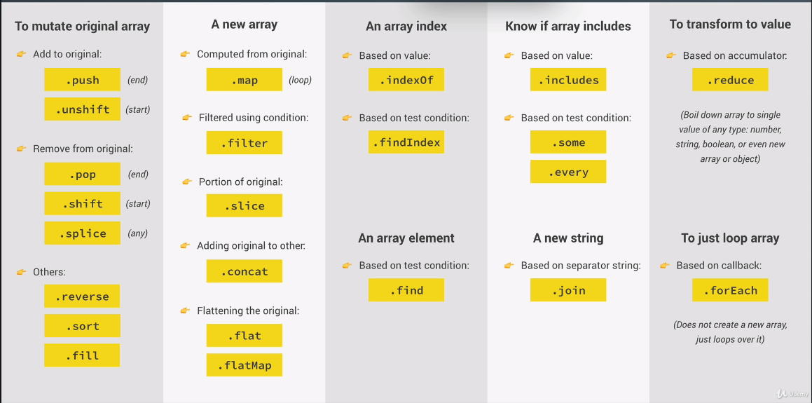
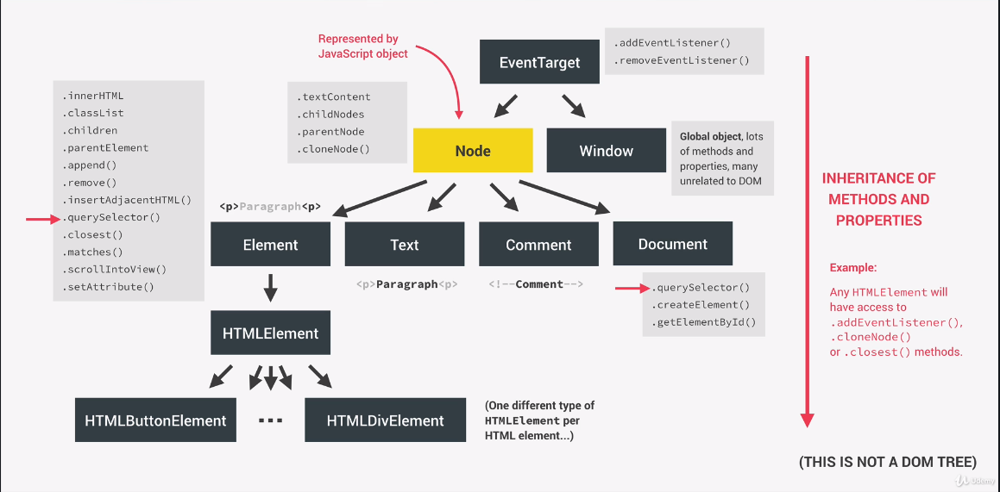
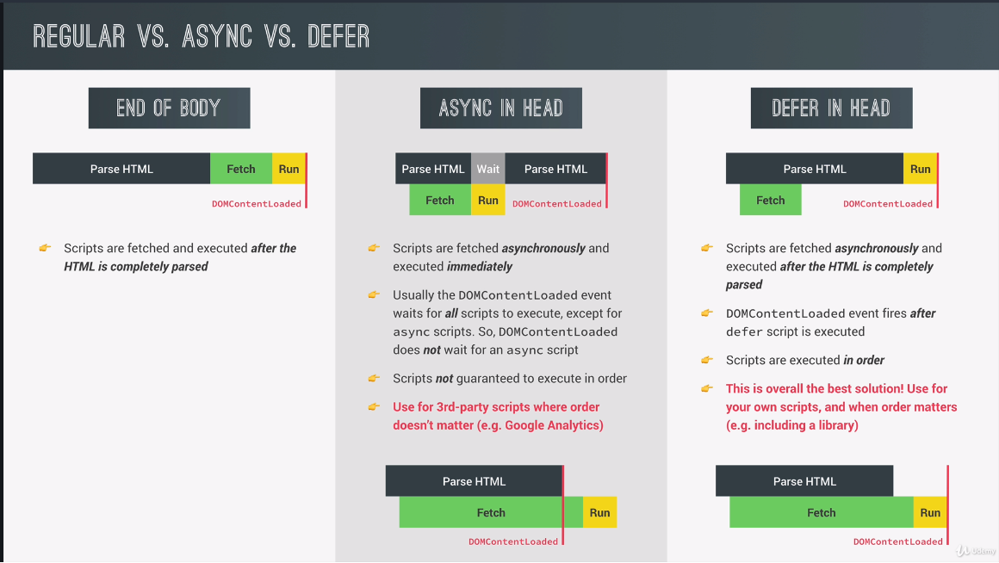
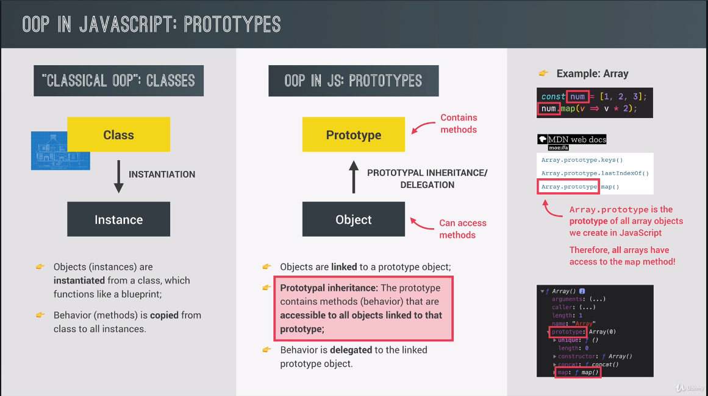
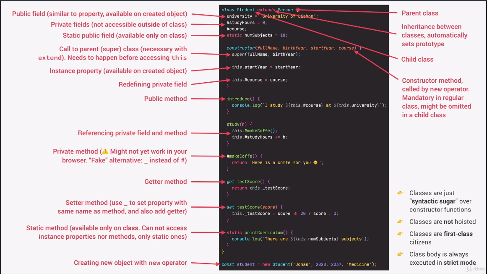

# JavaScript Bootcamp

1. ES = ECMAScript
1. ES6 on is modern JS
1. ES6 was created in 2015

## What is JavaScript?

It is a high-level, OO, multi-paradigm programming language

- Hight Level
  - Don't worry about complext stuff like memory management
- Object Oriented
- Multi-Paradigm
  - Can use different programming styles
  - Declarative, imperative

## What do we use it for?

3 Languages the web is written in

1. HTML
   - Content
   - Nouns
1. CSS
   - Presentation
   - Adjectives
1. JS
   - Programming Language for building web apps
   - Verbs

Makes modern web development and the web what it is today

## Javascript Frameworks

1. React
   - Front end
1. Angular
   - Front end
1. Vue
   - Front end
1. Node
   - Doesn't need a broswer, runs on a web server
   - Back-end app
1. React Native
   - Native mobile
1. Ionic
   - Native mobile
1. Electron
   - Native desktop

Tools that make writing modern, large, web apps easier

All based on 100% JS

## JavaScript Types

JavaScript has dynamic typing. Don't need to define a type until assigned

- Value has a type, not a variable

1. Number
   - Floating point numbers
1. String
   - Sequence of chars
1. Boolean
1. Undefined
   - Empty Value
1. Null
   - Also means empty value
   - My guess is the difference is it's assigned null instead of being unassigned
1. Symbol (ES2015)
   - Value that is unique and can't be changed
1. BigInt (ES2020)
   - Larger numbers thatn Number type can hold

## JavaScript History

- 1995
  - Brendan Eich and Netscape creates first version of JavaScript in 10 days
  - Called Mocha, but already had many fundamental features of modern JS
- 1996
  - Mocha changes to LiveScript and then to JavaScript in order to attract Java devs
  - However, it has nothing to do w/ Java
  - Microsoft launches IE, and copies Javascript from Netscape, calling it JScript
- 1997
  - With a need to standardize the language, ECMA releases ECMAScript 1 (ES1)
  - First official standard for JavaScript
- 2009
  - ES5 is released w/ lots of great new features
- 2015
  - ES6/ES2015 (ECMAScript 2015) was released: biggest update to the language ever
  - ECMAScript changes to annual release cyle
  - Less features per update
- 2016 on
  - Release of ES2016, etc...

**JavaScript is backwards compatible**

- Don't break the web
- Old features are never removed
- Not really new versions, just incremented updates
- Websites keep working forever
- Lots of older bugs and quirks still exist, but you can get around it by using modern JS

## How to Use Modern JS Today

### During Development

- Use latest/modern browser (Edge/Chrome)

### During Production

- Use Babel to transpile and polyfill your code
  - Convert to ES5 to ensure browser compatibilty for all users
- ES5 is fully supported in all browsers
- ES6+ is well supporeted in all modern browsers
  - No support in older browsers
  - Check the ES6 compatibility pages
- ESNext
  - Future versions of the language
  - So browsers can stay current w/ language releases
  - Stages to a release, so browser devs can be sure when a release is almost done

## JavaScript DOM

Document Object Model

- Basically, the connection point b/t HTML and JS code
- Structured representation of HTML documents
  - Allows JS to access HTML Elements and styles to manipulate them
- DOM is not part of JS
  - Part of WebAPIs that can interact w/ JS

# JavaScript Overview

Everything JS is:

1. High-Level
   - Low-level like C, where you have to manage computer resources
   - Don't have to manage these resources
1. Garbage-Collection
   - Cleans memory so we don't have to
1. Interpreted or just-in-time compiled
   - Abstract over machine code
   - Convert to machine code = compiling
     - Happens in js engine
1. Multi-paradigm
   - An approach and mindset of structuring code
   - Direct code style and technique
   - Procedural, OOP, Functional
     - JS does all of it
1. Prototype-based Object-oriented
   - Almost everything is an object except for primitives
   - Objects are built from prototypes
   - prototypes have all methods
1. First-class Functions
   - Functions are treaded as variables
   - pass them into other functions and return from other functions
1. Dynamic
   - dynamically typed
   - Can re-assign variables as different types
1. Single-threaded & Non-blocking event loop
   - JS engine handles multiple tasks happening at the same time
   - JS only runs in a single thread
   - So for long running tasks, JS uses an event loop
     - Takes long running task, executes in the background
     - Puts them back in the main thread once they are finished

## JavaScript Engine and Runtime

### Engine

- Program that executes JS code
- Every browser has it's own JS engine
  - Chrome's V8 engine
  - Edge's chakra
- All engines have
  - Call Stack (where code is executed)
  - Heap (where objects are stored)
- Parsers, compiles, then executes
- Optimizes multiple times when compiling and running code
  - Runs on threads we don't have access to

### Compilation vs Interpretation

1. Compilation
   - Entire code is converted into machine code
   - Written to bin file
   - Executed by computer
1. Interpretation
   - Interpreter runs through the source code and executes it line by line
   - Still needs to be converted, but happens at runtime, not before hand
   - Much slower than compiled languages
1. JIT compilation (just in time)
   - Entire code is converted into machine code at once, and then exectured immediately
   - Lot faster than executing code line by line

## Execution Context and Call Stack

### Execution Context

What happens after compilation?

1. Creation of global execution context (for top level code)
   - Not inside a function
1. Environment in which a piece of JS is executed
   - Stores all necessary information for some code to be executed
1. One global execution context
   - Default context
1. One execution context per function
1. All together, make call stack

What's inside?

1. Variable Environment
   - let, const, var declarations
   - Functions
   - arguments object
1. Scope chain
1. this keyword
   - arrow functions don't have this keyword or arguments function

### Call Stack

1. Place where execution contexts get stacked on top of each other
   - Keep strack of where we are in the execution

## Scope

1. How our program's variables are organized and accessed
1. JS uses lexical scoping
   - Scope is controlled by plaement of functions and blocks in code
1. Global scope, function scope, and block scope
   - Region where variables can be accessed
   - ES6 is where block scope came (only let and const)
   - var is **block** scoped. It is function scope

## Hoisting (variable environment)

Question is...should you use things before they are declared in a scripting based language?

- Functions are the main reason
  - Just put functions at the top?
- var hoisting is simply a by-product

1. Makes some types of variables accessible/usable in the code before they are actually declared
   - Variables lifted to the top of thier scope
1. Before execution, code is scanned for variable declarations
   - For each variable, a new property is created in the variable environment object
1. What are hoisted? (can be used before they are declared)
   - Functions (YES)
   - var (YES) (almost never use var in modern js)
   - let and const (NO)
   - function expressions and arrows (depends if created using var, let/const)
     - They are variables and behave the same way

## this Keyword

1. Special variable that is created for every execution (ever function)
   - Takes the value of the 'owner' of the function in which the 'this' keyword is used
1. NOT static
   - Depends on how the function is called
1. this does NOT point to the function itself or its variable environment
1. new, call, apply, bind

### Method

this = Object that is calling the method

### Simple Function Call

this = undefined

- In strict mode

### Arrow Functions

this = this of surrounding function (lexical this)

- They don't get thier own this keyword

### Event Listener

this = DOM element that the handler is attached to

## JavaScript Data Structures

What are they and when to use them

### Sources of Data

1. From the program itself
   - Data written directly in source code (status messages)
1. From the UI
   - Data input fromthe user or data written in DOM (tasks in todo app)
1. From external sources
   - Data fetched from web API (recipe object)

No matter where they come from, we will have collections of data

### Data Structures

1. Simple List?
   - Array or Set
1. Key Value Pair?
   - Object or Map
   - Keys let us describe values

When to use each?

1. Arrays
   - Use when you need ordered list of values (may contain dupes)
   - User when you need to manipulate data
1. Sets
   - Use when you need to work w/ unique values
   - Use when high performance is really important
   - Use to remove dupes
1. Objects
   - More 'traditional' key/value store
   - Easier to write and access values with '.' and '[]'
   - Use when you need to include functions
   - Use when working w/ json data (can convert to map)
1. Maps
   - Better performance
   - Keys can have any data type
   - Easy to iterate
   - Easy to compute size
   - Use when you need to map key to values
   - Use when you need keys that are not strings

## First-Class VS Higher-Order Functions

### First-Class Functions

1. JavaScript treats functions as **first-class citizens**
   - Just means, that functions are values
1. Functions are a nother 'type' of object
   - So, functions have methods

### Higher-Order Functions

1. Function that:
   - Receives another function as an argument
   - Returns a new function
   - Or both
1. Only possible b/c of first-class functions

## Array Methods

### Map, Filter, Reduce

1. Map
   - Returns a new array containing the results of applying an operation on all original array elements
1. Filter
   - Returns a new array containing the array elements that passed a specified test condition
1. Reduce
   - Boils (reduces) all array elements down to one single value (adding all elements together)

# The DOM

1. Allows us to make JS interact w/ the browser
1. We can write JS to create, modify, and delete HTML elements
   - Set styles, classes, and attributes
   - Listen and respond to events
1. DOM tree is generated from an HTML document, which we can then interact with
1. DOM is a very complex API that contains a lot of methods and properties to interact w/ the DOM tree
   - Different types of nodes
   - Some are HTML elements, some are text

## How the DOM is organized

1. Every item is a node
   - Represented by JS object
   - Element, Text, Comment, Document types

## Effecient Script Loading

Async and Defer only supported in modern browsers

# OOP In JavaScript

- Prototypes are the 'classes' in JS
  - Contains methods
  - Objects are linked to prototypes
- Prototypal inheritance
  - prototype contains methods that are accessible to all objects linked
- Behavior is delegated to the linked prototype object

## How to Create Prototypes?

1. Constructor Functions
   - Create objects from a function
   - How built-in objects like Arrays, Maps, or Sets are actually implemented
1. ES6 Classes
   - Modern alternative to constructor function syntax
   - 'Syntatic sugar': behind the scenes, work exactly like constructor functions
   - Do Not behave like classes in 'classical' OOP
1. Object.create()
   - Easiest and most straightforwared way of linking an object to a prototype object

## ES6 Classes

